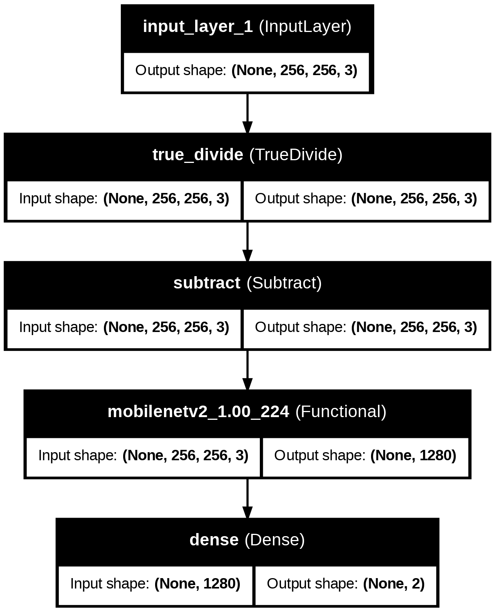
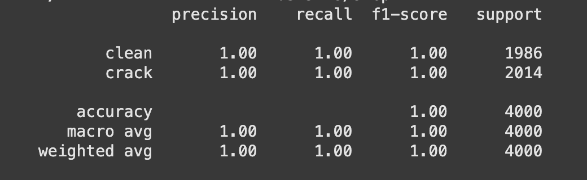
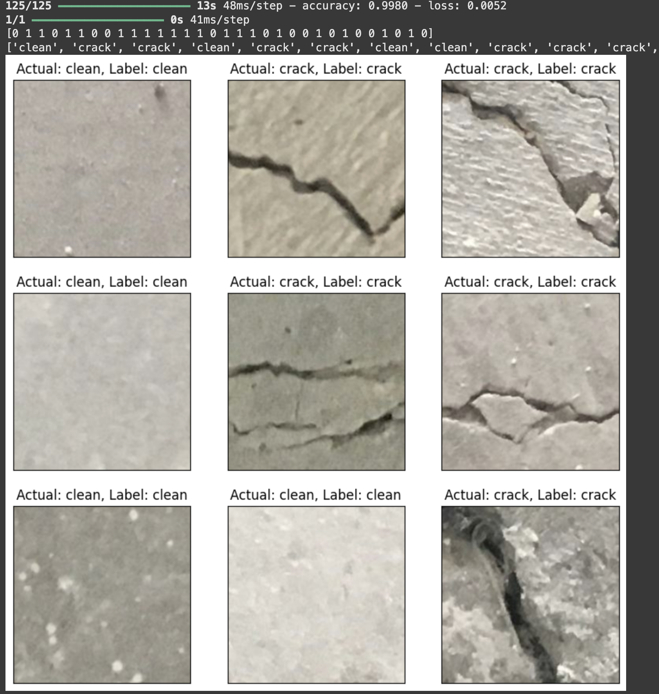

# Concrete Image Classification : Crack or Clean?

This repository is for image classification project to classify concretes with or without cracks. In this project, I implemented transfer learning technique by utilising the MobileNetV2 model as the base layer. The performance of the model is beyond satisfactory.  

## Model Architecture

# Model Performance
- classification report:

- Accuracy score + Plotting of the prediction on first batch of test dataset:

## Source code
2018 – Özgenel, Ç.F., Gönenç Sorguç, A. “Performance Comparison of Pretrained Convolutional Neural Networks on Crack Detection in Buildings”, ISARC 2018, Berlin. (https://data.mendeley.com/datasets/5y9wdsg2zt/2)

